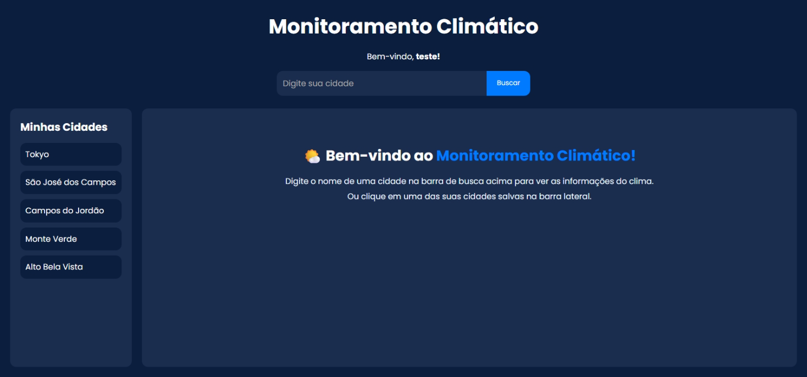
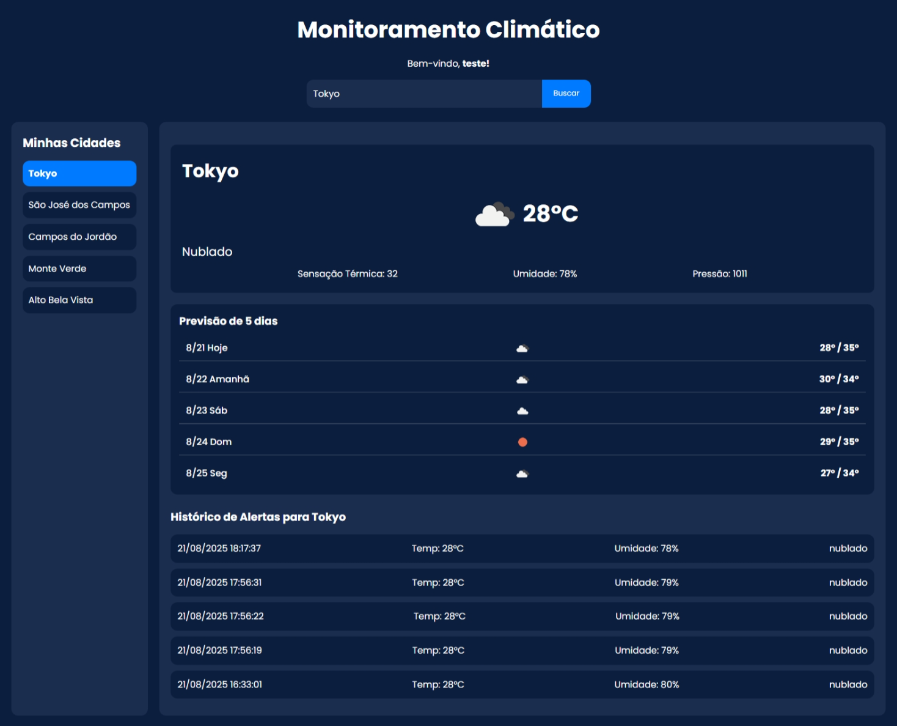
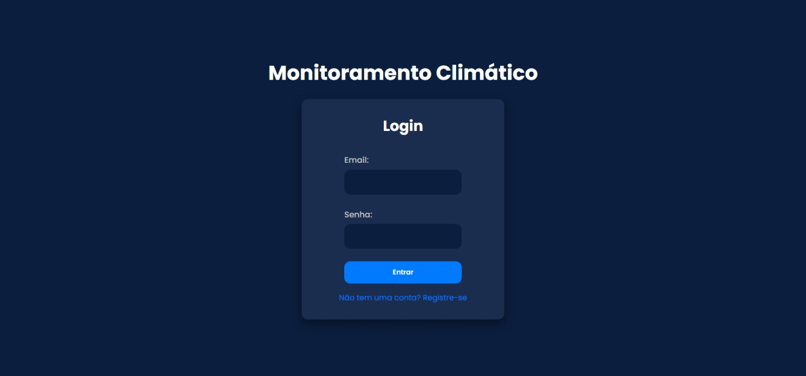
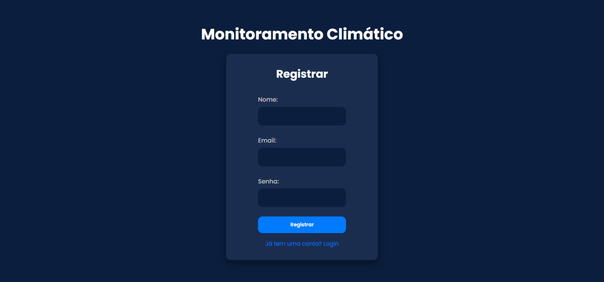
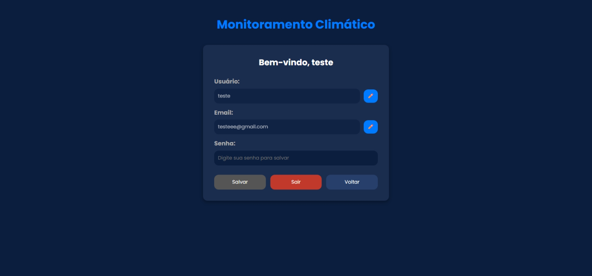

# 🌦️ Climate Monitoring

Aplicação full stack para monitoramento de condições climáticas, com cadastro de usuários, login, pesquisa de cidades, histórico e armazenamento de cidades favoritas.

## 🚀 Tecnologias

- React
- TypeScript
- Vite
- Node.js
- Express
- MongoDB
- Mongoose

## 🔧 Funcionalidades

- Cadastro e login de usuários
- Consulta de clima por cidade
- Salvamento de cidades
- Histórico de informações meteorológicas
- Interface responsiva

## 📸 Screenshots

### Página inicial

### Dashboard

### Login

### Cadastro

### Conta

## 🎯 Objetivo

Praticar o desenvolvimento de uma aplicação full stack integrando frontend, backend e banco de dados.

Desenvolvido por **Vitor Hens**.
